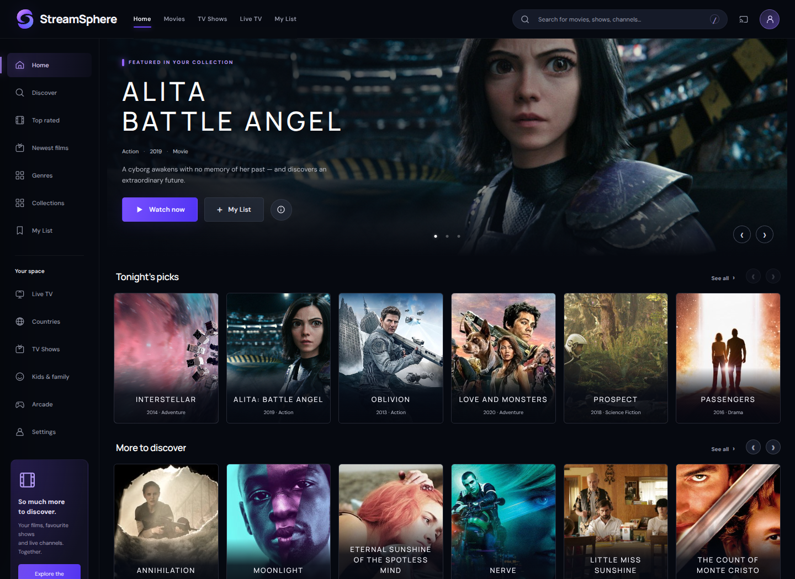
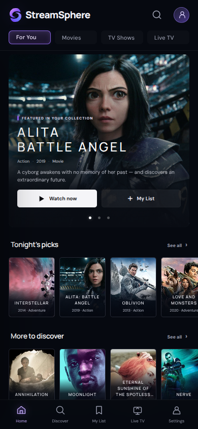
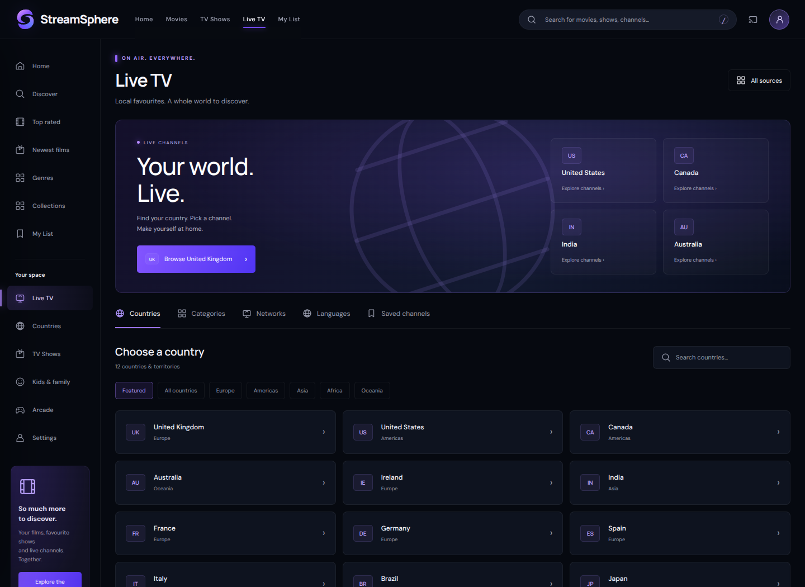
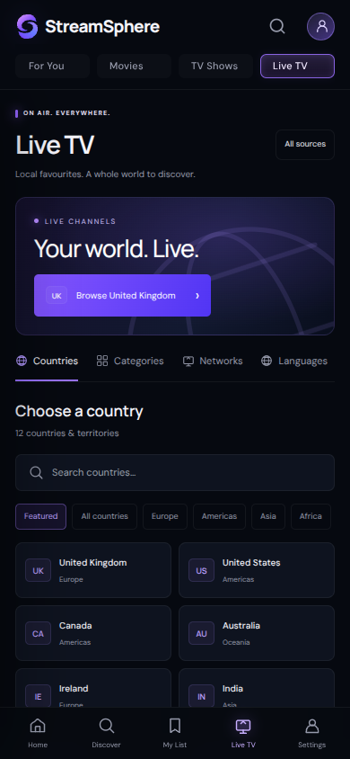
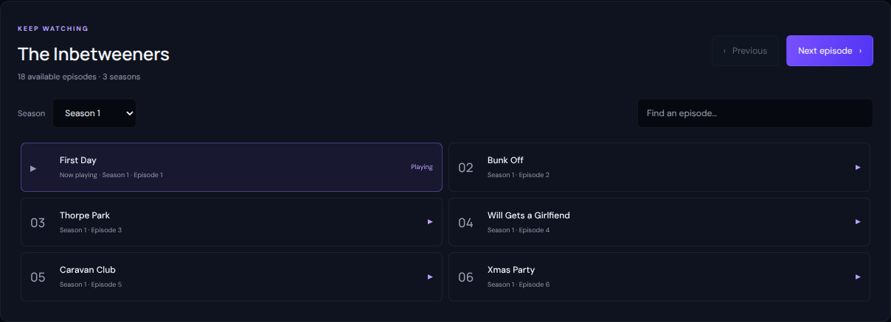
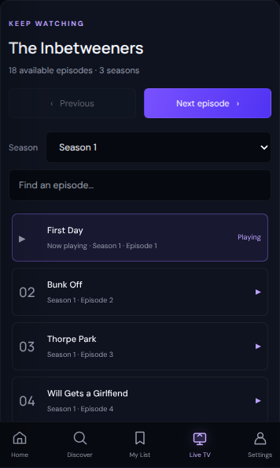

# StreamSphere — Discovery Hub

The supplied “Option 5 — Discovery Hub” image is the visual reference for this revision. The earlier sea-glass concept has been replaced by a near-black canvas, violet highlights and a cinematic catalogue layout.

## Desktop and mobile

- Desktop has a single compact header with the StreamSphere swirl mark, primary destinations, search, Cast and Settings. A permanent discovery sidebar leads to Home, Discover, Top rated, Newest films, Genres, Collections and My List, with TV Shows and country browsing below.
- The featured carousel uses real catalogue artwork, title metadata, Watch now, My List, details, previous/next controls and labelled selection dots. It does not advance automatically.
- Six portrait posters fit across the desktop content area, with restrained titles, metadata and shelf controls. Wide monitors show eight.
- Mobile has category chips, a portrait feature card, compact swipeable poster rows and persistent Home / Discover / My List / Live TV / Settings navigation.
- Continue Watching uses landscape cards with actual saved progress and remaining time. It appears after the first Home poster row when history exists, and is also available in My List.
- Collections remains an accessible source drawer. Settings also exposes source browsing, Kids & family, Arcade and light/dark appearance on mobile.
- Live TV retains its channel guide, network directory, stable channel numbers, search, category/sort controls and favourites. Search retains Movies / TV shows / Live channels scopes and episode selection.

The reference's fictional films, social profiles, trending rankings, programme schedules and download controls have not been introduced as pretend functionality. All visible destinations use the site's existing capabilities.

## First-paint artwork

Twelve editorial picks are drawn from the existing `My Movies` M3U playlist; each file was checked against its existing Archive item's metadata on 19 September 2026. No new stream providers or playback URLs were introduced. Artwork and metadata use the app's existing TMDB integration.

The initial selection, twelve posters and three feature backdrops are bundled so Home displays real content before remote catalogue and metadata requests finish. As soon as the current playlist loads, the selection is reconciled by exact stream URL; removed titles are discarded. If the source is offline, the last known selection remains visible. Playback remains subject to the original source's availability.

See [artwork provenance](../assets/discovery/README.md). DM Sans and Manrope are served locally, with their OFL licences in `assets/fonts/`.

## Validation

`tests/tv-experience.cjs` uses controlled playlists, metadata and watch history. It covers:

- Featured carousel navigation, keyboard focus retention, My List and real resume progress.
- Desktop sidebar, mobile destinations, source drawer and history preservation across section changes.
- Guide search, categories, favourites, stable numbering and cancellation of stale render chunks.
- Search scopes and Escape, detail-to-player handoff, media cleanup and series episode selection.
- Light/dark appearance and overflow checks at 320, 390, 768 and 1440 pixels.

Run with Node and Playwright:

```sh
npm install --no-save playwright
npx playwright install chromium
node tests/tv-experience.cjs
```

An existing browser can be selected with `BROWSER_EXECUTABLE_PATH`. Set `TAILWIND_CDN_PATH` to a local copy of the Tailwind CDN script for offline checks. The test server chooses a free port and closes on exit.

These checks verify interface behaviour and player handoffs, rather than the continued availability of every external stream or a physical Cast/AirPlay device.

## Implemented previews

The screenshots show the actual page and existing catalogue artwork. Empty watch history stays empty.







## Country browsing and continuous series playback

Live TV opens with country discovery. Search all countries, filter by continent, or switch to categories, networks, languages and saved channels. Each country guide has a country selector, category filters, search, stable channel numbering and favourites. Returning from a guide restores the country search.

The player keeps an independent series context for Archive box sets and M3U series. Every available episode remains accessible below the player, with season selection, episode search, a current-episode marker and Previous/Next controls. Episodes sort numerically; Next crosses season boundaries and playback advances on completion. Browsing another catalogue no longer changes the playing series. Duplicate Archive video encodes collapse to one episode. Saved episode history reloads its series context when necessary. Availability follows the existing sources; the interface does not claim absent episodes are playable.

The reference revision uses a single-scene feature, compact artwork tiles with embedded titles, and tighter desktop/mobile spacing.





Regression coverage includes country switching and category filtering within a country, duplicate Archive encodes, numeric episode ordering, season boundaries, auto-next, and maintaining the playing series after browsing a live lineup. External feeds are mocked for deterministic interaction checks; screenshots use the existing live catalogue.
